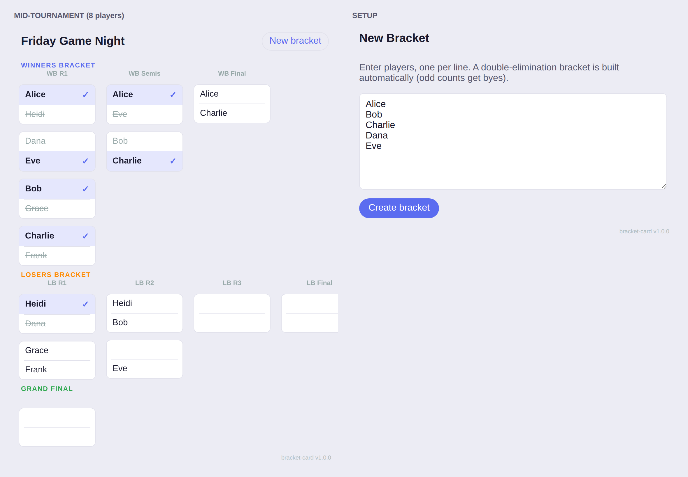

# Bracket Card for Home Assistant

A reusable **double-elimination tournament bracket** you drive from a Lovelace
dashboard — built for home game nights. Type in the players, tap the winner of
each match, and the bracket advances itself. One button starts a fresh bracket
next time.



- **Double elimination** — a losers bracket gives everyone a second chance, with
  an optional grand-final "bracket reset" game.
- **Any number of players (2–64)** — as many real first-round matches as
  possible; only the leftover player (if any) gets a bye.
- **Random draw** — the entered names are shuffled when the bracket is created.
- **Connected bracket view** — winners and losers brackets with connector lines,
  later rounds centred between their feeders, and the grand final on the right.
- **Reusable** — nothing is hard-coded. New game night = new bracket in seconds.
- **No custom integration, no Python** — a single frontend card. State lives in
  one `input_text` helper, so it survives restarts and is shared across every
  device looking at the dashboard.
- **Tap to advance / re-pick** — mis-tapped? Tap the other name; anything
  downstream that depended on it is cleared automatically.
- Follows your Home Assistant theme (light and dark).

---

## Installation (HACS)

This is distributed as a **HACS custom repository** (dashboard/plugin type).

1. In Home Assistant, open **HACS**.
2. Top-right **⋮ menu → Custom repositories**.
3. Add the repository:
   - **Repository:** `https://github.com/Wounded28886/ha-bracket-card`
   - **Type:** `Dashboard`
4. Find **Bracket Card** in the HACS list, open it, and click **Download**.
5. **Restart Home Assistant** (or reload resources) when prompted.

> HACS registers the Lovelace resource for you at
> `/hacsfiles/ha-bracket-card/ha-bracket-card.js`. If you ever add it by hand
> (Settings → Dashboards → ⋮ → Resources), use that URL with type
> **JavaScript Module**.

### Manual install (no HACS)

Copy `dist/ha-bracket-card.js` to `<config>/www/ha-bracket-card.js`, then add a
dashboard resource pointing at `/local/ha-bracket-card.js` (JavaScript Module).

---

## Setup

### 1. Create a text helper to hold the bracket state

**UI:** Settings → Devices & Services → **Helpers** → **＋ Create Helper** →
**Text** → name it e.g. `Game Night Bracket`, set **Maximum length** to `255`.

**or YAML** (`configuration.yaml`):

```yaml
input_text:
  game_night_bracket:
    name: Game Night Bracket
    max: 255
```

One helper per bracket you want to run at once. Want a permanent "board games"
bracket and a separate "Mario Kart" one? Make two helpers and two cards.

### 2. Add the card to a dashboard

Edit your dashboard → **＋ Add Card** → search **Bracket Card** (or use the YAML
editor):

```yaml
type: custom:bracket-card
entity: input_text.game_night_bracket
title: Friday Game Night
```

### 3. Play

1. Type player names into the setup box, one per line, and hit **Create bracket**.
   The draw is randomised, so the order you type them in doesn't matter.
2. Tap the winner of each match — the bracket fills the next rounds in as you go.
3. When it's done, the 🏆 champion banner appears.
4. **New bracket** clears it for the next game.

---

## Card options

| Option          | Type    | Default              | Description                                                        |
| --------------- | ------- | -------------------- | ------------------------------------------------------------------ |
| `type`          | string  | —                    | `custom:bracket-card` (required)                                   |
| `entity`        | string  | —                    | An `input_text` (or `text`) helper that stores the bracket (required) |
| `title`         | string  | `Tournament Bracket` | Heading shown on the card                                          |
| `reset_bracket` | boolean | `true`               | If `true`, the grand final is best-of-two when the losers-bracket player wins game 1 (a true double-elim "bracket reset"). Set `false` for a single decisive grand final. |

---

## How state is stored (and the 255-character note)

The card never stores the whole bracket tree. It stores only the player list and
which side won each match, as a compact JSON string in the helper — the full
graph is regenerated deterministically from that. This keeps the payload small:
**8 players fit comfortably** inside an `input_text` (max 255 chars).

For **large brackets with long names** (roughly 16+ players) the payload can
approach the 255-character `input_text` limit. If the card warns you it won't
fit, either use shorter display names, run fewer players, or point `entity` at a
`text` helper configured with a higher `max`.

---

## Development

```bash
npm test          # logic unit tests + jsdom card smoke test
npm run build     # bundle src/ -> dist/ha-bracket-card.js
```

- `src/bracket.js` — pure double-elimination engine (no DOM). Unit-tested in
  `test/bracket.test.mjs`.
- `src/card.js` — the Lovelace custom element.
- `dist/ha-bracket-card.js` — the bundled file HACS serves. **Generated** — run
  `npm run build` after editing `src/`.

## License

MIT
